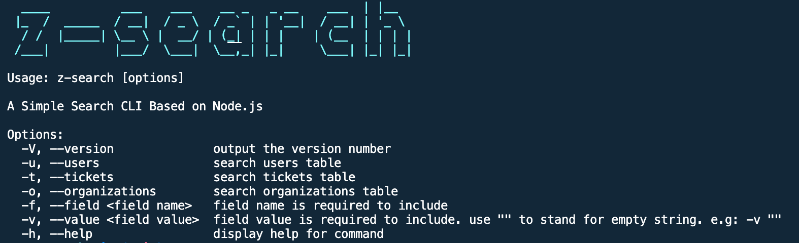
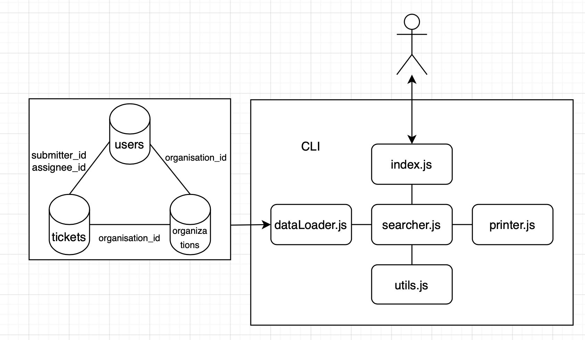

# Z - Search

A simple command line application to search the provided data and return the results in a human readable format.



## Features

- Case-insensitive and full-value (including empty values and array item) searching for any field in users, tickets and organizations.
- Retrieve all relevant data based on the relationships between different tables. (e.g. searching tickets can get users and organizations related to these tickets)
- Handle and display error when invalid values are provided
- Use inverted index to achieve O(1) search efficiency , which has good performance to handle large dataset.
- Modulized and fully tested source code, which is easy to be extended.

## Architecture

The architecture of the source code is shown as below.

- dataLoader is responsible for loading the data and generating index map and inverted index map.
- printer is responsible for printing messages on the screen.
- searcher interacts with dataLoader and printer to provide searching apis.
- index has the CLI interactive logic and interacts with both user and searcher
- utils has some util functions serving searcher



## Usage

Z-Search requires [Node.js](https://nodejs.org/) v12.16.3+ to run.

Install the dependencies and start the cli.

```sh
$ cd z-search
$ npm i
$ npm run setup
```

If `$npm run setup` fails, try this command below. It would ask you to type in Admin password to allow installing package globally in your system. (no harm, don't worry :))

```sh
$ npm run setup:sudo
```

Run testing

```sh
$ cd z-search
$ npm i
$ npm run test
$ npm run coverage
```

Run search:

```sh
$ z-search [-u/-t/-o] -f <fieldName> -v <fieldValue>
```

z-search support seaching fieldName with fieldValue within one or multiple tables, which means these two below are equal:

```sh
$ z-search -u -t -f _id_ -v '1'
```

```sh
$ z-search -u -f _id_ -v '1'
$ z-search -t -f _id_ -v '1'
```

## Usage Examples

- Check the version of this search cli

```sh
$ z-search -V
```

- Look for help for usages

```sh
$ z-search -h
```

- Search users by any field. It will return all relavent tickets and organizations.

```sh
$ z-search -u -f name -v 'Francisca Rasmussen'

//search users for alias with a value of empty
$ z-search -u -f alias -v '‘
```

- Search tickets by any field. It will return all relavent organizations and users.

```sh
$ z-search -t -f subject -v 'A Nuisance in Ghana'
$ z-search -t -f has_incidents -v 'false'
```

- Search organizations by any field. It will return all relavent users and tickets

```sh
$ z-search -o -f details -v 'non profit'
$ z-search -o -f submitter_id -v '4'
```

## Dependency

Z-Search uses these open-source libraries below:

- [Commander](https://www.npmjs.com/package/commander)
- [figlet](https://www.npmjs.com/package/figletr)
- [chalk](https://www.npmjs.com/package/chalk)
- [lodash](https://www.npmjs.com/package/lodash)
- [Jest](https://www.npmjs.com/package/jest)
